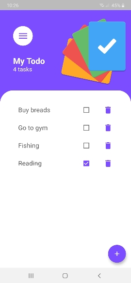
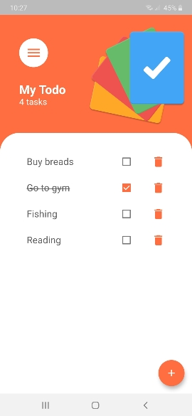

# My Todo

- A new Flutter project to track the tasks you want to do throughout your day.
- You can add , remove , and delete any tasks you want.
- All tasks will be saved on the device using SharedPreference.

    
      

# Packages implemented 
- Provider 
- Get it 
- Shared Preference

This project is a starting point for a Flutter application.

